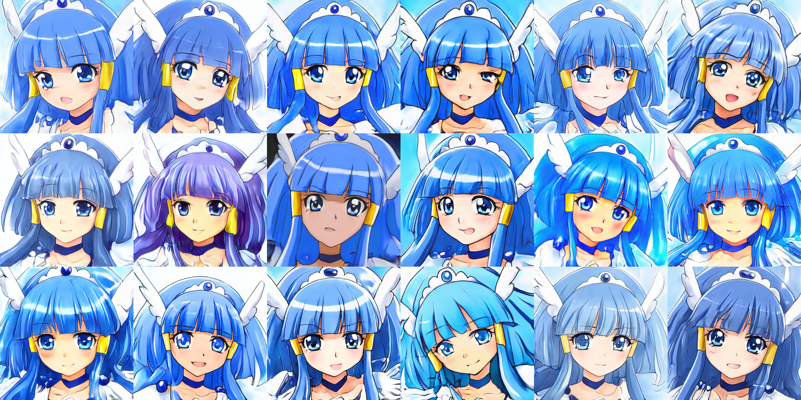
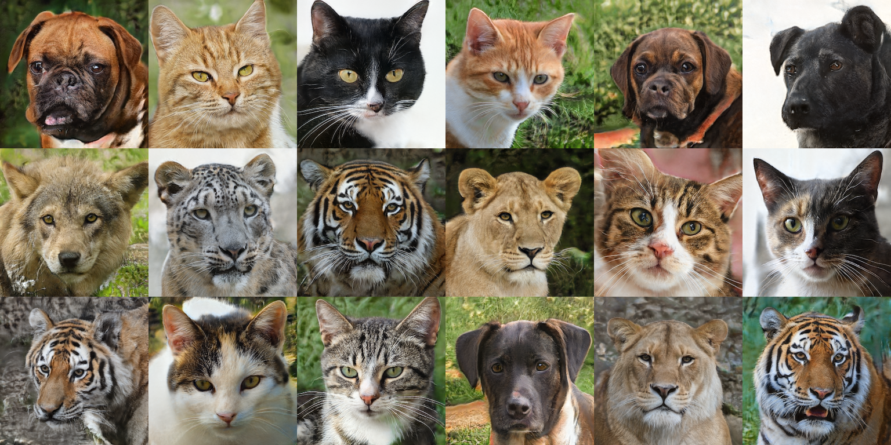
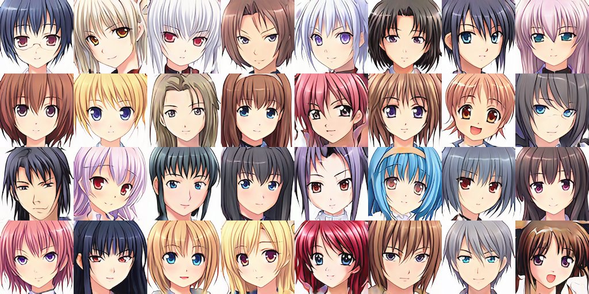
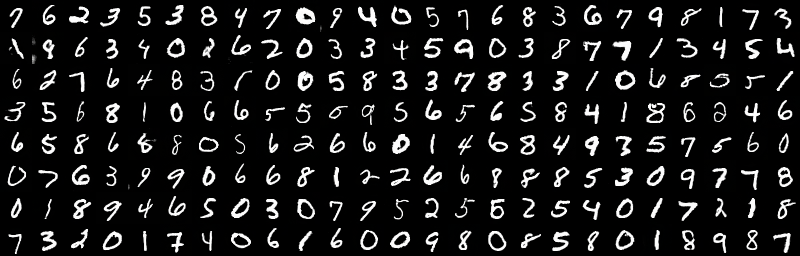
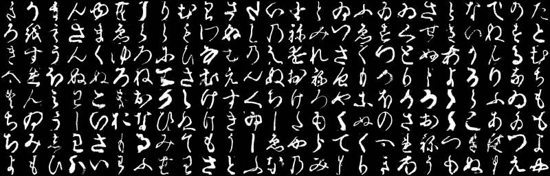

# Precure StyleGAN ADA

StyleGAN 2.0 implementation using Chainer with Adaptive Discriminator Augmentation

## Abstract

This project follows on from [the previous project: Precure StyleGAN](https://github.com/curegit/precure-stylegan).
We aimed to generate facial images of a specific Precure (Japanese Anime) character using the StyleGAN 2.0.
We employed Adaptive Discriminator Augmentation (ADA) to improve the image quality, as the previous project showed that the dataset was too small to train decent GANs naively.
We trained the models on facial images of Cure Beauty (Smile Pretty Cure!, 2012), whose dataset size is about 3k, and achieved a score of 21.98 in FID, much better than the previous project.
We also trained the models on other common datasets, demonstrating the stability and robustness of our implementation.



## Requirements

- Python >= 3.8
- Chainer >= 7.2
- Pillow >= 9.1
- NumPy >= 1.17
- h5py
- tqdm

Use `requirements.txt` to install minimal dependencies for inferencing.

```
pip3 install -r requirements.txt
```

### For training

- CuPy (with CUDA & cuDNN)
- Matplotlib

You should need GPU support to train your own models.
Note that it does not support distributed training across multiple GPUs.

Matplotlib is required to draw learning curves.

### Extras

Install the following to run `visualize.py`.

- Pydot (with GraphViz)

## Models

We provide distributable trained generators on common datasets in the `models` folder.

- Flickr-Faces-HQ
- Animal Faces-HQ (conditional)
- Anime Faces
- MNIST (conditional)
- Kuzushiji-49 (conditional)

You can quickly try them out like this.

```
python3 generate.py models/afhq.hdf5 -l cat -o output
```

## Results

We use ψ = 1.0 (no truncation applied) to evaluate for each Fréchet Inception Distance (FID).

### Cure Beauty (ψ = 0.8, FID = 21.98, ADA enabled)


### Flickr-Faces-HQ (ψ = 0.9, FID = 15.61)


### Animal Faces-HQ (ψ = 0.8, FID = 7.64, conditional, ADA enabled)



### Anime Faces (ψ = 0.7, FID = 13.81)



### MNIST (ψ = 1.1, FID = 2.61, conditional)



### Kuzushiji-49 (ψ = 1.0, FID = 3.77, conditional, ADA enabled)



### Style Mixing

### Animations

## Scripts

### `show.py`

### `generate.py`

This script generates images using a trained model.
Use the `-h` option for more details.

```
python3 generate.py models/afhq.hdf5 -n 100 -l dog -o output
```

### `mix.py`

This script mixes styles from style files and creates style-mixed images.
  Use the `-h` option for more details.
### `combine.py`

### `animate.py`

makes an animation of the analogy from a trained model.
  Use the `-h` option for more details.

### `train.py` trains StyleGAN models.
  Use the `-h` option for more details.

### `visualize.py`

draws an example of a computation graph for debugging (Pydot and Graphviz are required).

### Small Tools

- `tools/check.py` analyzes the Chainer environment.
- `tools/tile.py` creates a N by M tiled image matrix.

## See Also

- [StyleGAN FastAPI](https://github.com/curegit/stylegan-fastapi)
- [Precure StyleGAN](https://github.com/curegit/precure-stylegan) (old project)

## References

### Papers

- [Analyzing and Improving the Image Quality of StyleGAN](https://arxiv.org/abs/1912.04958)
- [Training Generative Adversarial Networks with Limited Data](https://arxiv.org/abs/2006.06676)
- [Mode Seeking Generative Adversarial Networks for Diverse Image Synthesis](https://arxiv.org/abs/1903.05628)
- [On Leveraging Pretrained GANs for Generation with Limited Data](https://arxiv.org/abs/2002.11810)

### Datasets

- [THE MNIST DATABASE of handwritten digits](http://yann.lecun.com/exdb/mnist/)
- [Deep Learning for Classical Japanese Literature](https://arxiv.org/abs/1812.01718)
- [Anime-Face-Dataset](https://github.com/Mckinsey666/Anime-Face-Dataset)
- [Flickr-Faces-HQ Dataset (FFHQ)](https://github.com/NVlabs/ffhq-dataset)

## License

[CC BY-NC 4.0](LICENSE)
