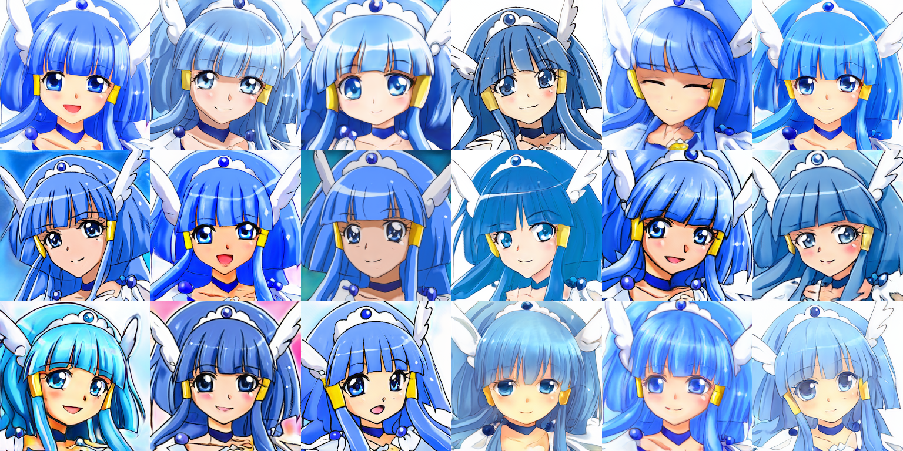
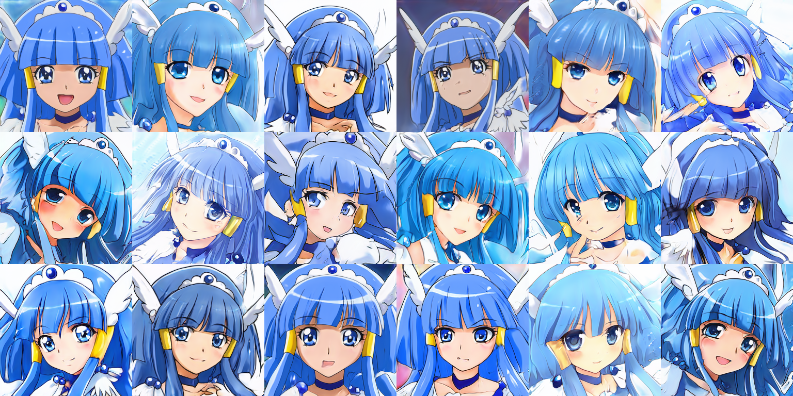
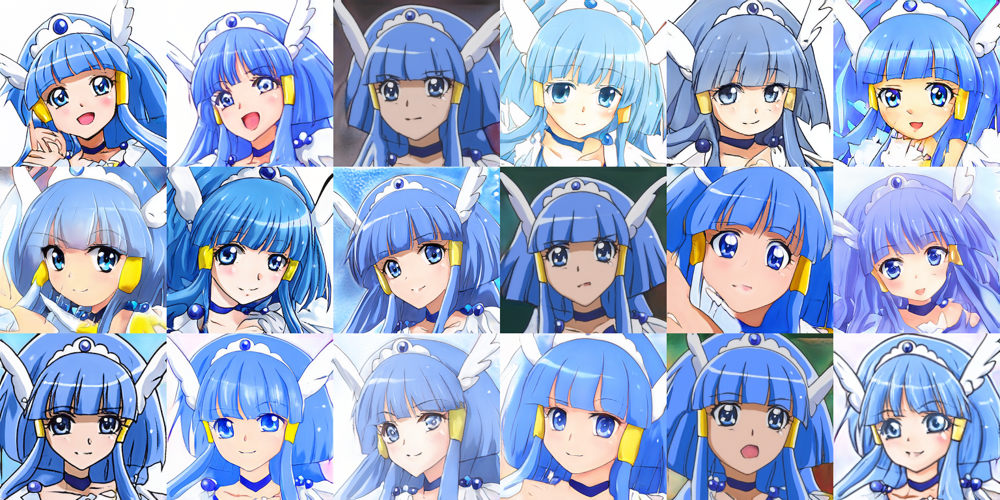
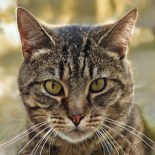
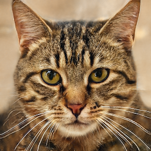
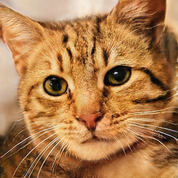
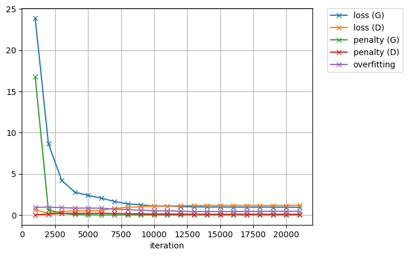

# Precure StyleGAN ADA

StyleGAN 2.0 implementation using Chainer with Adaptive Discriminator Augmentation

## Abstract

This project follows on from [the previous project: Precure StyleGAN](https://github.com/curegit/precure-stylegan).
We aimed to generate facial images of a specific Precure (Japanese Anime) character using the StyleGAN 2.0.
We employed Adaptive Discriminator Augmentation (ADA) to improve the image quality, as the previous project showed that the dataset was too small to train decent GANs naively.
We trained the models on facial images of Cure Beauty (Smile Pretty Cure!, 2012), whose dataset size is about 3k, and achieved a score of 17.39 in FID, much better than the previous project.
We also trained the models on other common datasets, demonstrating the stability and robustness of our implementation.



## Requirements

- Python >= 3.8
- Chainer >= 7.2
- Pillow >= 9.1
- NumPy >= 1.17
- h5py
- tqdm

Use `requirements.txt` to install minimal dependencies for inferencing.

```sh
pip3 install -r requirements.txt
```

### For training

- CuPy (with CUDA & cuDNN)
- Matplotlib

You should need GPU support to train your own models.
Note that our implementation does not support distributed training across multiple GPUs.

Matplotlib is required to draw learning curves.

### Extras

Install the following to run `visualize.py`.

- Pydot (with GraphViz)

## Model Zoo

We provide these pre-trained generators on common datasets in the `models` folder.

- Flickr-Faces-HQ
- Animal Faces-HQ (conditional)
- Anime Faces
- MNIST (conditional)
- Kuzushiji-49 (conditional)

You can quickly try them out like this.

```sh
python3 generate.py models/afhq.hdf5 -o output
```

## Results

We use ψ = 1.0 (no truncation applied) to evaluate for each Fréchet Inception Distance (FID).

All the examples below are uncurated, and all truncations are applied with the `-C` option (shrinking to each class).

### Cure Beauty v1 (ψ = 0.8, FID = 21.98, ADA enabled, batch = 16, R1 = 100)



### Cure Beauty v2 (ψ = 0.8, FID = 17.39, ADA enabled, batch = 12, R1 = 75)

The smaller batch size and lesser gradient penalty brought better quality and diversity.



### Flickr-Faces-HQ (ψ = 0.9, FID = 15.61)


### Animal Faces-HQ (ψ = 0.8, FID = 7.64, conditional, ADA enabled)


### Anime Faces (ψ = 0.7, FID = 13.81)


### MNIST (ψ = 1.1, FID = 2.61, conditional)


### Kuzushiji-49 (ψ = 1.0, FID = 3.77, conditional, ADA enabled, MSGAN)

For this training, we used Mode Seeking Regularization (MSGAN) due to problems associated with multiclass data that has a large number of categories.


## Manipulation Examples

### Style Interpolation

|          Original 1           |                  Averaged                   |          Original 2           |
| :---------------------------: | :-----------------------------------------: | :---------------------------: |
|  |  |  |

### Style Mixing

#### 2-Mix

|                 Level 1–4                  |                 Level 5–7                  |                   Result                   |
| :----------------------------------------: | :----------------------------------------: | :----------------------------------------: |
|  |  |  |

#### 3-Mix

|                 Level 1–3                  |                 Level 4–5                  |                 Level 6–7                  |                   Result                   |
| :----------------------------------------: | :----------------------------------------: | :----------------------------------------: | :----------------------------------------: |
|  |  |  |  |

### Interpolation Animation


## Scripts

### `show.py`

This script shows information of a trained generator.

For example, to check the MNIST model, use:

```sh
python3 show.py models/mnist.hdf5
```

### `generate.py`

This script generates images utilizing a trained model.
Use the `-h` option for more details.

For example, to generate 100 dog images in the `output` folder using the AFHQ model, type:

```sh
python3 generate.py models/afhq.hdf5 -n 100 -l dog -o output
```

### `combine.py`

This script performs linear combination on style vectors from style files, creating a new style file and image.
Use the `-h` option for more details.

Example 1: To average two cats:

```sh
python3 generate.py models/afhq.hdf5 -n 2 -l cat -t 0.8 -o cats
python3 combine.py models/afhq.hdf5 -n 1 cats/1-style.npy cats/2-style.npy -c 0.5 0.5 -o new-cat
```

Example 2: To generate 3 human face images and add the style vector difference from image 2 to image 3 to image 1:

```sh
python3 generate.py models/ffhq.hdf5 -n 3 -t 0.8 -o faces
python3 combine.py models/ffhq.hdf5 -n 1 faces/1-style.npy faces/2-style.npy faces/3-style.npy -c 1 -1 1 -o new-face
```

### `mix.py`

This script mixes styles from style files and creates style-mixed images.
Use the `-h` option for additional details.

For instance, to generate 2 anime face images and mix them, use:

```sh
python3 generate.py models/anime.hdf5 -n 2 -o anime
python3 mix.py models/anime.hdf5 -n 1 anime/1-style.npy ... ... anime/2-style.npy -o anime-mix
```

### `animate.py`

This script makes an animation of the analogy using a trained generator.
Use the `-h` option for more details.

For example, to create an animation that interpolates 10 face samples using the FFHQ model, use:

```sh
python3 animate.py models/ffhq.hdf5 -n 10 -L -o analogy
```

### `train.py`

Use this script to train your own models.
Use the `-h` option for more details.

Basically, you need to specify the directories for your dataset, the network architecture parameters, and the training duration.
Image data should be in RGB or Gray formats with 8-bit depth, and in powers of two square images.
Use the `-x` option to fit the network shape to the image size of the target dataset.

`--ada` switch enables Adaptive Discriminator Augmentation.

For example, to start training the AFHQ model:

```sh
# Run 100 epochs on GPU
python3 train.py -e 100 -o training-result -x 7 -b 32 -g 4 -k 8 --ada CAT_IMAGE_DIR DOG_IMAGE_DIR WILD_ANIMAL_IMAGE_DIR -l cat dog wild -v GPU
```

To resume training from a snapshot:

```sh
# Run another 50 epochs on GPU
python3 train.py -e 50 -s training-result/snapshot.hdf5 -o training-result-resumed -b 32 -g 4 -k 8 --ada CAT_IMAGE_DIR DOG_IMAGE_DIR WILD_ANIMAL_IMAGE_DIR -l cat dog wild -v GPU
```

While network architecture is restored from the snapshot, other hyperparameters are not, so you must pass them again.
Also, you should specify the additional training length, not the total duration, because elapsed training duration will not be serialized.

Training curves at the beginning of the training typically look like this:



#### Transfer Learning

To perform transfer learning and fine-tuning, you can use a combination of the `-t` option and the `-Z` option.

Here are some examples of Cure Twinkle transferred from Cure Beauty v2, which was trained on approximately 300 images.


### `visualize.py`

This script draws computation graphs for debugging (Pydot and GraphViz are required).
Use the `-h` option for more details.

### Small Tools

- `tools/check.py` analyzes the Chainer environment.
- `tools/tile.py` creates an N by M tiled image matrix.

## See Also

- [StyleGAN FastAPI](https://github.com/curegit/stylegan-fastapi)
- [StyleGAN Vue](https://github.com/curegit/stylegan-vue)
- [StyleGAN Web](https://github.com/curegit/stylegan-web)
- [Precure StyleGAN](https://github.com/curegit/precure-stylegan) (old project)

## References

### Papers

- [A Style-Based Generator Architecture for Generative Adversarial Networks](https://arxiv.org/abs/1812.04948)
- [Analyzing and Improving the Image Quality of StyleGAN](https://arxiv.org/abs/1912.04958)
- [Training Generative Adversarial Networks with Limited Data](https://arxiv.org/abs/2006.06676)
- [Mode Seeking Generative Adversarial Networks for Diverse Image Synthesis](https://arxiv.org/abs/1903.05628)
- [On Leveraging Pretrained GANs for Generation with Limited Data](https://arxiv.org/abs/2002.11810)

### Datasets

- [THE MNIST DATABASE of handwritten digits](http://yann.lecun.com/exdb/mnist/)
- [Deep Learning for Classical Japanese Literature](https://arxiv.org/abs/1812.01718)
- [Anime-Face-Dataset](https://github.com/Mckinsey666/Anime-Face-Dataset)
- [Flickr-Faces-HQ Dataset (FFHQ)](https://github.com/NVlabs/ffhq-dataset)

## License

[CC BY-NC 4.0](LICENSE)
